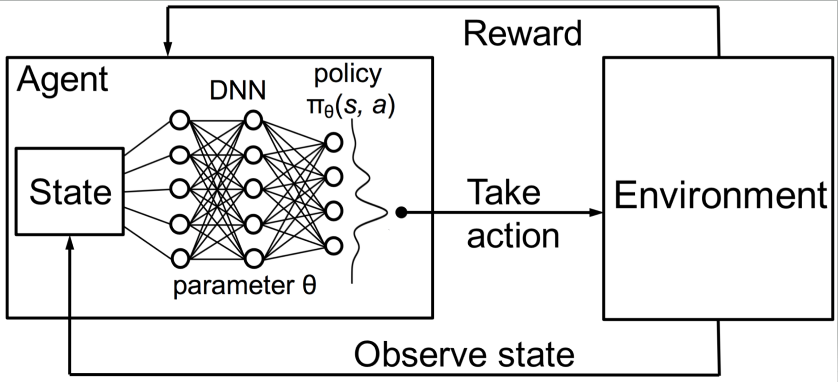

<link rel="stylesheet" href="https://cdnjs.cloudflare.com/ajax/libs/KaTeX/0.5.1/katex.min.css">
<link rel="stylesheet" href="https://cdn.jsdelivr.net/github-markdown-css/2.2.1/github-markdown.css"/>

[//]: # (Image References)

[image1]:  (./images/agent_environment.png) "Reinforcement Learing"
# Banana Unity environment solution Report

This project implements a Dueling Double Deep Q Network to learn how to navigate within the environment and collect rewards.
## Learning Algorithm
In reinforcement learning, an agent interacts with an environment in order to learn an optimal policy. As shown in below diagram, the agent observes the state from the environment, and based on a value_action DNN function approximator (Q Function), takes an action that is sent to the environment. The environment will respond with a new state, as well as a reward(if any). The agent will use this information (state, performed action, next state, reward) to improve it's Q Function and continue the loop

In order to experiment and learn, the agent chooses it's next action stochasticaly, and not just by selecting the next action based on highest expected reward. Specifically, the agent asigns a probability to be chosen to all other actions too so that it can explore alternative routes to reward. This functionality is implemented here through an epsilon-greedy algorithm, which initially explores alternatives at a high rate (hyper parameter `eps_start`) of 95% and linearly decays this to a minimum exploration of 1% (hyper parameter `eps_end`) with a rate of `eps_decay` per episode.

### Q function approximator
This project implements a dueling Q network for the Q function approximator, as detailed in  [Dueling Network Architectures for Deep Reinforcement Learning, 2015, Wang et al.](https://arxiv.org/abs/1511.06581)

Learning is performed through gradient descent. and at each step the loss and gradient that are computed are:

### Double Q Learning
This project implements a double Q learning solution

# Learning Algorithm
This project is an implementation of the [Prioritized Experience Replay,Google DeepMind](https://arxiv.org/pdf/1511.05952.pdf) paper.

All the aforementioned components:
* Deep NN Dueling architecture for Q Function
* Priority Replay Buffer
* Double Q Learning

are implemented with below algorithm:

<a href="https://www.codecogs.com/eqnedit.php?latex=\begin{align*}&space;&{[1]\bold{Input:}&space;\text{minibatch}\,&space;k,&space;\text{step-size}&space;\,\tau,\eta,\,&space;\text{replay&space;period}&space;\,K&space;\text{and&space;size}\,&space;N,\text{exponents}&space;\,\alpha\,&space;\text{and}\,&space;\beta,&space;\text{episodes}\,&space;T.}\\&space;&{[2]\text{Initialize&space;replay&space;memory}\,&space;\mathcal{H}=\emptyset,&space;\Delta&space;=&space;0,&space;p_1=1}\\&space;&{[3]Initialize\,&space;two\,&space;Q\,&space;networks,&space;Q_{local}(s,a;\theta_{local})\,&space;and&space;Q_{target}(s,a;\theta_{target})}\\&space;&{[4]Observe&space;\,&space;S_0&space;\,&space;and\,&space;choose\,&space;A_0&space;\sim&space;\pi_{\theta_{local}}(S_0)}\\&space;&{[5]\bold{for}\,&space;t=1&space;\,&space;\bold{to}&space;\,&space;T&space;\,&space;\bold{do}}\\&space;&{[6]\quad&space;\text{Observe}\,&space;S_t,R_t}\\&space;&{[7]\quad&space;\text{Store&space;transition}\,&space;S_{t-1},A_{t-1},R_t,&space;S_t\,&space;in&space;\mathcal{H}&space;\,&space;\text{with&space;maximal&space;transition&space;priority}\,&space;p_t&space;=&space;1}\\&space;&{[8]\quad&space;\bold{if}&space;\,&space;t\,&space;\bold{mod}&space;\,K==0\,&space;\bold{then}}\\&space;&{[9]\quad\quad\bold{for&space;}j=1\,&space;\bold{to&space;}\,&space;k&space;\,\bold{&space;do}}\\&space;&{[10]\quad&space;\quad\quad&space;\text{Sample}\,&space;k\,&space;\text{transitions&space;from}\,&space;\mathcal{H}\,&space;j&space;\sim&space;P(j)&space;=&space;\frac{{p_j}^a}{\sum_i{{p_i}^a}}}\\&space;\end{}" target="_blank"></a>
<a href="https://www.codecogs.com/eqnedit.php?latex=\begin{align*}&space;&{[11]\quad\quad\quad\text{Compute&space;importance-sampling&space;weights}\,w_j=\frac{({N*P(j)})^{-b}}{\max_iw_i}}\\&space;&{[12]\quad\quad\quad\text{Compute&space;TD-error}\,&space;\delta_j=R_j&plus;\gamma&space;Q_{target}(S_j,\text{arg}\max_a{Q_{local}(S_j,a)})-Q_{local}(S_{j-1},A_{j-1}}\\&space;&{[13]\quad\quad\quad\text{update&space;transition&space;priority}\,&space;p_j\leftarrow&space;\left&space;|&space;\delta_j&space;\right&space;|}\\&space;&{[14]\quad\quad\quad\text{Accumulate&space;weight-change}\,&space;\Delta&space;\leftarrow&space;\Delta&space;&plus;&space;w_j&space;*&space;\delta_j*\nabla_{\theta}Q(S_{j-1},&space;A_{j-1})}\\&space;&{[15]\quad\quad\bold{end\,&space;for}}\\&space;&{[16]\quad\quad&space;\text{Update&space;weights}\,&space;\theta\leftarrow\theta&plus;\eta*\Delta&space;\,,\text{reset}\,\Delta}\\&space;&{[17]\quad\quad&space;\text{Transfer&space;}Q_{local}&space;\text{&space;values&space;to&space;}&space;Q_{target}\Rightarrow&space;\theta_{target}\leftarrow\tau\theta_{target}&plus;(1-\tau)\theta_{local}}\\&space;&{[18]\quad\bold{end&space;\,&space;if}}\\&space;&{[19]\quad\text{Choose&space;action&space;}A_t\sim\pi_\theta(S_t)}\\&space;&{[20]\bold{end&space;\,&space;for}}&space;\end{}" target="_blank"></a>

## The Environment

## Plot of Rewards
## Ideas for future work
This agent has been trained on a state space that consisted of a vector of 37 features.
The improvement that could be done, is to actually process directly the pixels of what the agent is seeing first person, which would result in a state-space of 84x84 RGB image. ie a state space of 84x84x3

