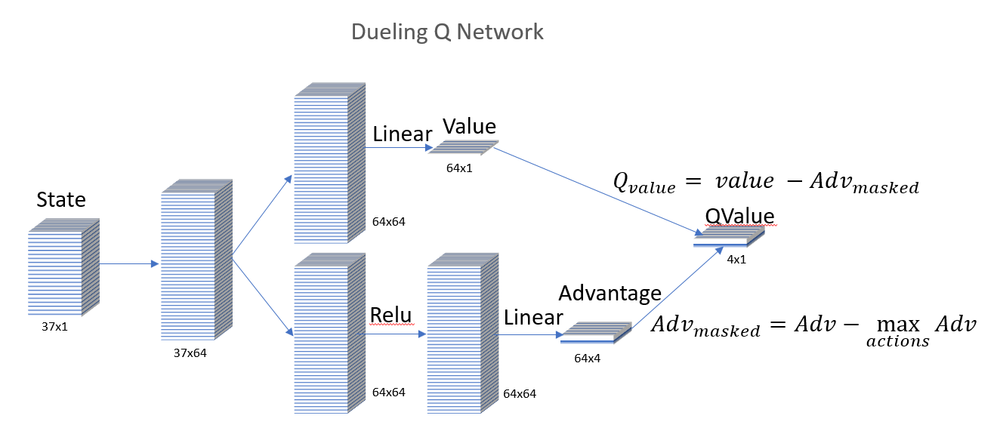
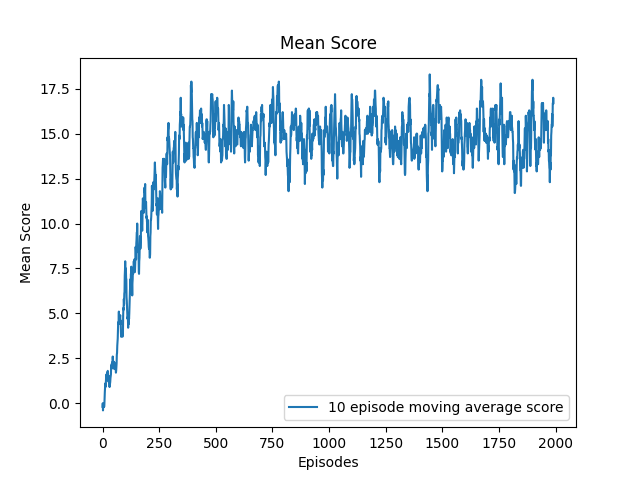

<link rel="stylesheet" href="https://cdnjs.cloudflare.com/ajax/libs/KaTeX/0.5.1/katex.min.css">
<link rel="stylesheet" href="https://cdn.jsdelivr.net/github-markdown-css/2.2.1/github-markdown.css"/>

[//]: # (Image References)

[image1]:  (./images/agent_environment.png) "Agent Environment"
[image2]:  (./images/dueling_q_NN.png) "dueling Q Network"
# Banana Unity environment solution Report

This project implements a Dueling Double Deep Q Network to learn how to navigate within the environment and collect rewards.
## Learning Algorithm
In reinforcement learning, an agent interacts with an environment in order to learn an optimal policy. As shown in below diagram, the agent observes the state from the environment, and based on a value_action DNN function approximator (Q Function), takes an action that is sent to the environment. The environment will respond with a new state, as well as a reward(if any). The agent will use this information (state, performed action, next state, reward) to improve it's Q Function and continue the loop.


By learning the value-action pair (Q), our agent can learn the optimal policy which will allow it to select the best next action in a state, based on the value each action would bring. Under the Bellman equation, the action value pair (s,a) under our policy is the expected value given the reward we got for taking action a, plus the discounted value that the best action would give us in the next state. This is formulated as follows:

<a href="https://www.codecogs.com/eqnedit.php?latex=\begin{align*}&space;Q_\pi(s,a)=\mathbb{E}_{\pi}\left[r_{t&plus;1}&space;&plus;\gamma&space;Q_\pi(s_{t&plus;1},a_{t&plus;1})&space;\right&space;]&space;\\&space;\end{}" target="_blank"></a>


Since we use a replay buffer, we use an offline method for learning Q in steps with a step size alpha, specifically the Q-learning:

<a href="https://www.codecogs.com/eqnedit.php?latex=\begin{align*}&space;&{Q(s_t,a_t)&space;=&space;Q(s_t,a_t)&space;&plus;&space;\alpha(r_{t&plus;1}&plus;\gamma\max_aQ(s_{t&plus;1},a)-Q(s_t,a_t))}&space;\end{}" target="_blank"></a>


### dueling Q function approximator
This project implements a dueling Q network for the Q function approximator, as detailed in  [Dueling Network Architectures for Deep Reinforcement Learning, 2015, Wang et al.](https://arxiv.org/abs/1511.06581)


This paper proposes, given a state, to create two neural network branches that will be learning the state's mean value and each action's advantage respectively. The states value is a scalar, while the advantage is a vector of size action_space. The mean state value is added to the advantage vector(with it's best action value however negated). Since the maximum advantage action is actually  This technique forces the Q function approximator to separate the mean state value from each action. 

The DNN layout is presented below:



Implementation of this DNN is through class `dueling_QNetwork` and can be found in [model.py](./models/model.py).

The parameters of this NN are part of the Q function, thus our Q-Learning becomes:

<a href="https://www.codecogs.com/eqnedit.php?latex=\begin{align*}&space;&{\text{TD-error}&space;=&space;(r_{t&plus;1}&plus;\gamma\max_aQ(s_{t&plus;1},a,\theta)-Q(s_t,a_t,\theta))}\\&space;&{\text{and&space;the&space;change&space;in&space;weights&space;becomes:}}\\&space;&{\Delta&space;\theta=\alpha\left[TD-error&space;\right&space;]\nabla_\theta&space;Q(s,a,\theta)}&space;\end{}" target="_blank"></a>

Both the discount <a href="https://www.codecogs.com/eqnedit.php?latex=\inline&space;\gamma" target="_blank"></a> as well as the learning rate <a href="https://www.codecogs.com/eqnedit.php?latex=\inline&space;\alpha" target="_blank"></a> are available as hyper parameters `gamma` and `lr` respectively.

### Double Q Learning
This project implements a double Q learning solution as detailed in [Deep Reinforcement Learning with Double Q-learning](https://arxiv.org/abs/1509.06461) by Van Hasselt to solve the problem that is due to using the same samples both to determine the maximizing action and to estimate its value.

Basically, we have two Q functions, that have the same network, but with a different set of weights. One is used to determine the greedy policy and the other to determine its value. Our TD-error function, thus becomes:

<a href="https://www.codecogs.com/eqnedit.php?latex=\begin{align*}&space;&{\text{TD-error}&space;=&space;\left[r_{t&plus;1}&plus;&space;\gamma&space;Q(s_{t&plus;1},\arg&space;\max_a&space;Q(s_{t&plus;1},a;\theta)&space;;\theta&space;')&space;\right&space;]-Q(s_t,a_t;\theta))}&space;\end{}" target="_blank"></a>


In order to make sure both networks gain value, we gradually transfer the weights of one network to the other at the end of each learning cycle. The rate of transfer is controlled via hyperparameter `tau` as follows:

<a href="https://www.codecogs.com/eqnedit.php?latex=\theta&space;\leftarrow&space;\tau\theta&space;&plus;&space;(1-\tau)\theta'" target="_blank"></a>

The implementation of the double Q learning can be found in class `DDQNPrioritizedAgent` in [DDQN.py](./agent/DDQN.py).

### Prioritized Replay Buffer
This project is an implementation of the [Prioritized Experience Replay,Google DeepMind](https://arxiv.org/pdf/1511.05952.pdf) paper.

The concept of a replay buffer is to store every agent-environment interaction (state,action,next-state,reward) into a buffer and then sample randomly from this buffer a batch of experiences in order to execute a learning step. In this implementation, the buffer size and batch size are available as hyper parameters `buffer_size` and `batch_size` respectively.

The prioritized replay buffer (PRE) introduces the idea of sampling these experiences for learning not completely randomly, but with extra probability to be sampled given to the experiences that can contribute most to learning. These would be the experiences that have the largest absoluted TD-error.

In order to do this, when sampling, the PRE splits the buffer into bins and then samples randomly from these bins. The number of bins is the batch size. The novelty is that the bins are not composed of equal number of experiences, but of experiences that have an equal cumulative sum. Thus, a bin that would have experiences with a small TD-error would have many experiences in it from which to randomly sample, while a bin containing a high TD-error experience would have few experiences, increasing the probability that the high TD-error will be selected for learning.

PRE defines the priority of an experience i in relation to the absolute value of the TD-error plus a minimum priority to ensure all cases get sampled as follows:

<a href="https://www.codecogs.com/eqnedit.php?latex=\inline&space;p(i)&space;=&space;\left|\delta_i&space;\right|&plus;\epsilon" target="_blank"></a>

The probability to be sampled is defined in relation to a prioritization factor alpha and the sum of all priorities in the buffer. Factor alpha controls the amount of prioritization, with 0 corresponding to uniform. Probability is thus defined as follows:

<a href="https://www.codecogs.com/eqnedit.php?latex=P(i)=\frac{{p_i}^\alpha}{\sum_k{{p_k}^\alpha}}" target="_blank"></a>

Note that factor alpha is available as hyper parameter `alpha`.

This sampling allows for quicker learning, however the distribution of experiences in relation to what the agent will encounter in the environment is now biased. To counter this, PRE introduces an importance sampling weight for each experience so that experiences with a higher priority will contribute less in the Q network learning gradient descent. The non-normalized importance sampling weight is controlled by the parameter beta and is defined as follows:
<a href="https://www.codecogs.com/eqnedit.php?latex=w(i)=\left&space;({\frac&space;{1}{N*P(i)}}&space;\right&space;)^\beta" target="_blank"></a>

N being the buffer size. This is then normalized by the maximum weight in the buffer. It follows that the maximum weight will be from the experience that has the smallest probability P(i). The parameter beta is annealed to 1 during the learning experience. The starting beta, the linear decay rate, as well as the final beta value are available as hyper parameters `beta`, `beta_decay`, and `beta_end` respectively.

#### PRE performance implementation details
As described above, prioritized replay buffer needs to compute a running sum for each experience, every time a sampling is requested in order to segment the experiences into bins. To avoid having to compute this every time, a segment tree with a sum operation has been used, and thus the cummulative sum is updated in O(nlogn) instead of O(n^2).

Furthermore, to compute the importance sampling weights, the minimum probability experience needs to be found in the whole buffer, every time a sampling is requested. Again, to avoid having to compute this with O(n^2) a segment tree with a min operation has been used, reducing the time complexity to O(nlogn).

The implementation of the prioritized replay buffer is through class `PrioritizedReplayBuffer` in [buffer.py](./buffer/ReplayBuffer.py).

# Complete Algorithm

Putting together all the aforementioned components:
* Deep NN Dueling architecture for Q Function
* Double Q Learning
* Prioritized Replay Buffer

are implemented with below algorithm:


<a href="https://www.codecogs.com/eqnedit.php?latex=\begin{align*}&space;&{[1]\bold{Input:}&space;\text{minibatch}\,&space;k,&space;\text{step-size}&space;\,\tau,\eta,\,&space;\text{replay&space;period}&space;\,K&space;\text{and&space;size}\,&space;N,\text{exponents}&space;\,\alpha\,&space;\text{and}\,&space;\beta,&space;\text{episodes}\,&space;T.}\\&space;&{[2]\text{Initialize&space;replay&space;memory}\,&space;\mathcal{H}=\emptyset,&space;\Delta&space;=&space;0,&space;p_1=1}\\&space;&{[3]Initialize\,&space;two\,&space;Q\,&space;networks,&space;Q_{local}(s,a;\theta_{local})\,&space;and&space;Q_{target}(s,a;\theta_{target})}\\&space;&{[4]Observe&space;\,&space;S_0&space;\,&space;and\,&space;choose\,&space;A_0&space;\sim&space;\pi_{\theta_{local}}(S_0)}\\&space;&{[5]\bold{for}\,&space;t=1&space;\,&space;\bold{to}&space;\,&space;T&space;\,&space;\bold{do}}\\&space;&{[6]\quad&space;\text{Observe}\,&space;S_t,R_t}\\&space;&{[7]\quad&space;\text{Store&space;transition}\,&space;S_{t-1},A_{t-1},R_t,&space;S_t\,&space;in&space;\mathcal{H}&space;\,&space;\text{with&space;maximal&space;transition&space;priority}\,&space;p_t&space;=&space;1}\\&space;&{[8]\quad&space;\bold{if}&space;\,&space;t\,&space;\bold{mod}&space;\,K==0\,&space;\bold{then}}\\&space;&{[9]\quad\quad\bold{for&space;}j=1\,&space;\bold{to&space;}\,&space;k&space;\,\bold{&space;do}}\\&space;&{[10]\quad&space;\quad\quad&space;\text{Sample}\,&space;k\,&space;\text{transitions&space;from}\,&space;\mathcal{H}\,&space;j&space;\sim&space;P(j)&space;=&space;\frac{{p_j}^a}{\sum_i{{p_i}^a}}}\\&space;\end{}" target="_blank"></a>
<a href="https://www.codecogs.com/eqnedit.php?latex=\begin{align*}&space;&{[11]\quad\quad\quad\text{Compute&space;importance-sampling&space;weights}\,w_j=\frac{({N*P(j)})^{-b}}{\max_iw_i}}\\&space;&{[12]\quad\quad\quad\text{Compute&space;TD-error}\,&space;\delta_j=R_j&plus;\gamma&space;Q_{target}(S_j,\text{arg}\max_a{Q_{local}(S_j,a)})-Q_{local}(S_{j-1},A_{j-1}}\\&space;&{[13]\quad\quad\quad\text{update&space;transition&space;priority}\,&space;p_j\leftarrow&space;\left&space;|&space;\delta_j&space;\right&space;|}\\&space;&{[14]\quad\quad\quad\text{Accumulate&space;weight-change}\,&space;\Delta&space;\leftarrow&space;\Delta&space;&plus;&space;w_j&space;*&space;\delta_j*\nabla_{\theta}Q(S_{j-1},&space;A_{j-1})}\\&space;&{[15]\quad\quad\bold{end\,&space;for}}\\&space;&{[16]\quad\quad&space;\text{Update&space;weights}\,&space;\theta\leftarrow\theta&plus;\eta*\Delta&space;\,,\text{reset}\,\Delta}\\&space;&{[17]\quad\quad&space;\text{Transfer&space;}Q_{local}&space;\text{&space;values&space;to&space;}&space;Q_{target}\Rightarrow&space;\theta_{target}\leftarrow\tau\theta_{target}&plus;(1-\tau)\theta_{local}}\\&space;&{[18]\quad\bold{end&space;\,&space;if}}\\&space;&{[19]\quad\text{Choose&space;action&space;}A_t\sim\pi_\theta(S_t)}\\&space;&{[20]\bold{end&space;\,&space;for}}&space;\end{}" target="_blank"></a>

In order to experiment and learn, the agent chooses it's next action stochasticaly, and not just by selecting the next action based on highest expected reward. Specifically, the agent asigns a probability to be chosen to all other actions too so that it can explore alternative routes to reward. This functionality is implemented here through an epsilon-greedy algorithm, which initially explores alternatives at a high rate (hyper parameter `eps_start`) of 95% and linearly decays this to a minimum exploration of 5% (hyper parameter `eps_end`) with a rate of `eps_decay` per episode.

## The training Environment
The agent was trained with the following hyperparameters:

```python
std_learn_params = {
        # Unity Environment parameters
        "banana_location": "./Banana_Windows_x86_64/Banana.exe",
        # MDP learning parameters
        "n_episodes": 2000, # maximum episodes to train on
        "eps_start":0.975,  # starting exploration factor
        "eps_end":0.05,     # ending exploration factor
        "eps_decay":0.99,   # eps step decay
        'early_stop': 13,   # early stop if average reward in 100 episode reaches this value
        
        # Q value learning parameters
        "gamma": 1,         # discount factor
        "tau": 1e-3,        # for soft update of target parameters
        "lr": 5e-4,         # learning rate 
        "update_every": 4,  # how often to update the network
        
        # Replay Buffer / Prioritized Replay Buffer parameters
        "buffer_size": 1e5,         # replay buffer size
        "batch_size": 32,           # minibatch size
        "alpha": 0.8,               # prioritization factor 
        "pr_eps": 1e-05,            # minimum prioritization
        "beta":0.4,                 # Importance sampling beta factor start
        "beta_step": 0.00025/4.0,   # beta decay factor
        "beta_max": 1.0             # maximum beta
    }
```
## Plot of Rewards
With the above parameters, the agent was able to solve the game (average reward over 100 episodes >13) in 259 episodes.

Below is the reward per episode (moving average of 10 episodes) for this agent.



## Ideas for future work
This agent has been trained on a state space that consisted of a vector of 37 features.
The improvement that could be done, is to actually process directly the pixels of what the agent is seeing first person, which would result in a state-space of 84x84 RGB image. ie a state space of 84x84x3


